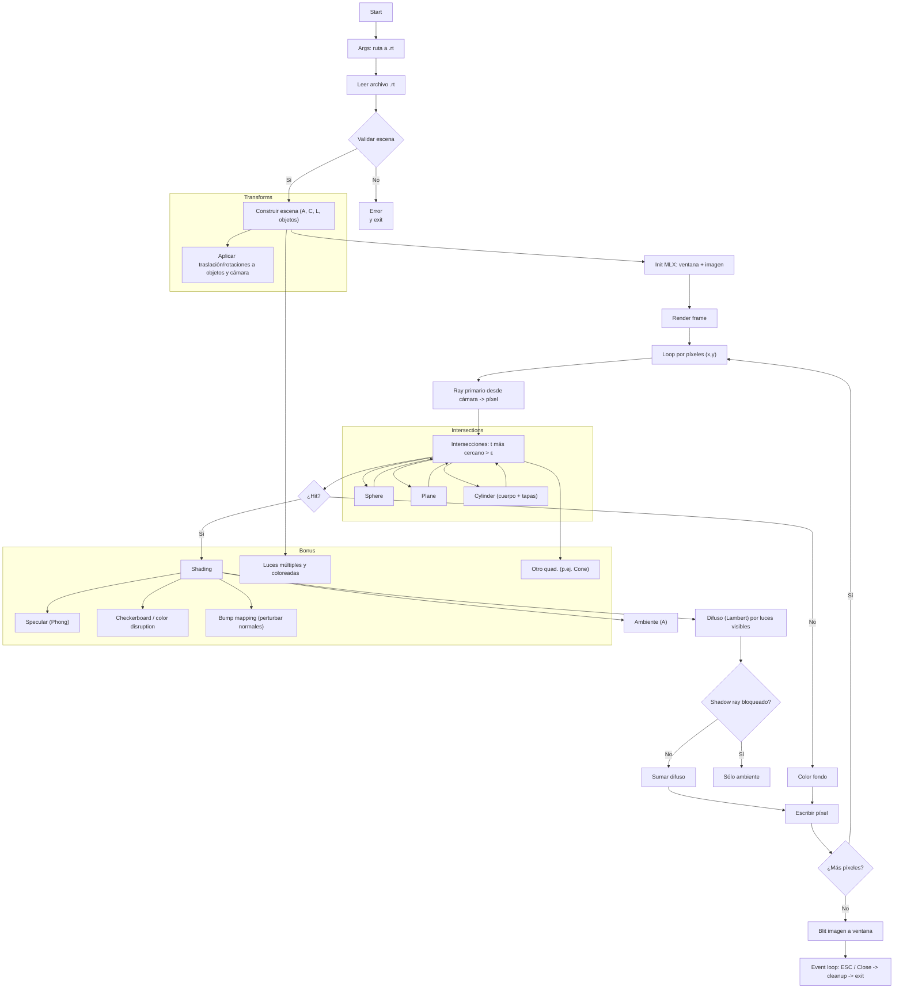
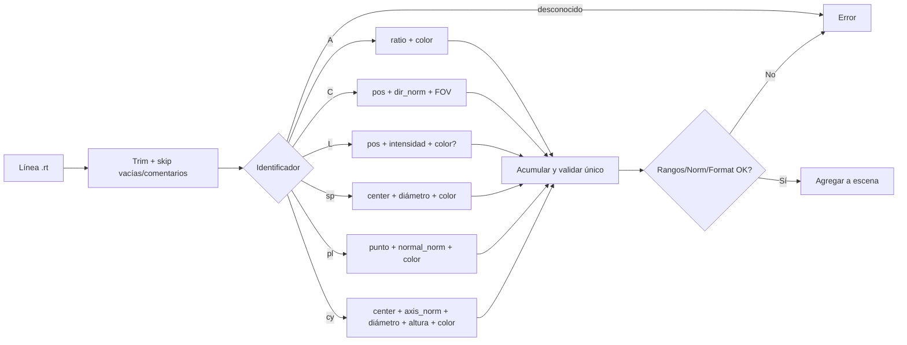

# miniRT — Flowcharts y guía de enfoque

Este documento resume el pipeline de miniRT (mandatorio + bonus) y el flujo del parser de escenas `.rt`.

## Flowchart principal

Notas clave:
- Validación: A, C, L únicos; rangos válidos; vectores normalizados; colores 0–255; FOV 0–180.
- Transformaciones: esfera y luces sin rotación; resto sí. Usa sistema coherente (espacio mundo u objeto).
- Sombras duras: shadow ray con bias ε para evitar acne; bloquear si intersección en (ε, dist_luz).

## Flowchart del parser `.rt`

## Orden de implementación sugerido

1) Matemáticas base: vec3, dot, cross, normalización, ray.
2) Intersecciones: sphere, plane, cylinder (cuerpo + tapas) con ε, t_min/t_max.
3) Parser + validaciones + modelo de datos de escena.
4) Cámara: generación de rayos primarios y render scanline.
5) Iluminación: ambiente + difuso + sombras duras.
6) MLX: ventana, imagen, eventos (ESC/red cross), cleanup.

Bonus (en este orden práctico):
- Specular (Phong) y clamping de color.
- Checkerboard en `pl` (y opcional UV simples en `sp`/`cy`).
- Luces múltiples y coloreadas (sumatoria por luz con visibilidad).
- Nuevo objeto (cone): intersección + normal + tapas.
- Bump mapping: perturbar normal (mapa o procedural) antes del BRDF.

---
Sugerencia: añade un pequeño `ε = 1e-4` para evitar self-intersections y usa `t_min = ε`, `t_max = INF` en todas las pruebas de intersección y sombras.
